# Matrix Based Methods For Graphs Manipulations - integration
Integration of matrix-based methods for graph manipulations enhanced with semantics - graph manipulations and clustering  

Both parts of our application such as graph matching and hierarchical clustering has been created according research papers.
During their realization we developed unit tests to verify functionality on attached data to these research papers. 
For graph matching based on nodes we tested node similarity matrix by creating the same line and house as is depicted in figure 1.1.
For coupled node - edge graph matching we tested method on Figure 2 and Table 1 not forgetting also to test their method
(on results provided in presentation https://www.cs.uoi.gr/~pvassil/downloads/GraphDistance/LauraZager.pdf) on similar structure from previous case. 
The next tested algorithm was Energy Bound Algorithm described and accompanied by given example in Modern Database Systems book. 
For Hungarian method we used already developed one from https://github.com/KevinStern/software-and-algorithms/blob/master/src/main/java/blogspot/software_and_algorithms/stern_library/optimization/HungarianAlgorithm.java
and tested on https://www.wisdomjobs.com/e-university/quantitative-techniques-for-management-tutorial-297/hungarian-method-for-solving-assignment-problem-9898.html.
Algorithm needed to be wrapped into another class which subtracts maximal value (from the matrix) from each matrix member due to requirement of finding maximal outcome
(maximal scores) from given optimization, thus not minimum. All tests passed, but in case of graph comparison algorithms few numbers were wrongly 
rounded to the nearest thousandth what is probably caused by doubled precision. One number had the third to fourth decimal number changed,
which we fixed. We created also other tests for checking correctness of matrix operations, transformations and other operations.

## Integrated approach

SEMANTIC SIMILARITY METRICS - Folder: semanticAttributesAggregation  
SIMPLE ANGULAR PARSER - Folder: parser, functionalityNodes  
JAVASCRIPT OBJECT REPRESENTATION HANDLING OBJECTS - Folder: javascriptObjectRepresentations

Launching the application: 
- import external jars from lib folder  
- set paths to Angular projects (works with Puzzle To Play application available in https://github.com/jperdek/puzzleToPlay) and DB setting in MainConfiguration.java in main package:
  (NOTE: second application Design 3D is not publicly available, but i can give you access to it for testing purposes (parser is simple and may fail on other applications if parsing conditions are not met - parsing AST is for future work)- still methods are covered with unit tests) 
  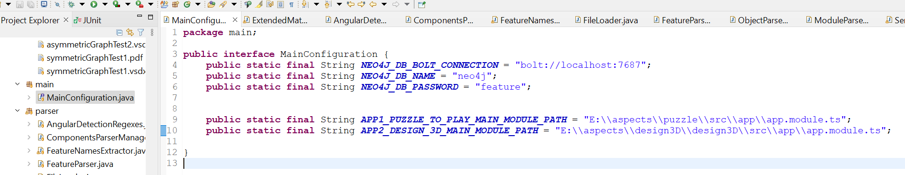
- install and launch neo4j db (tip for Windows: "E:\neo4j\bin\neo4j.bat" console) and open GUI (http://localhost:7474/browser/)
  

### Lauch whole process (both apps are required)
- 1. launching FeatureDataInsertion.java in graphConstruction package:   
  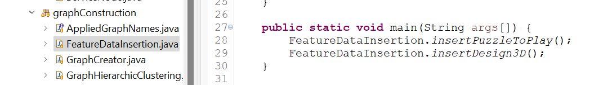
	- result should be following:  
  	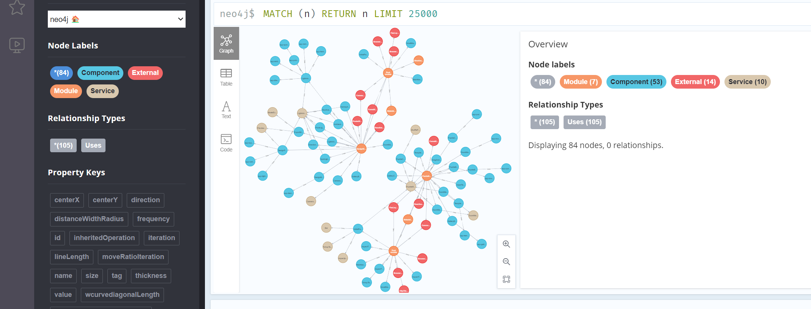
- 2. launching GraphsClustering.java in graphConstruction package:  
  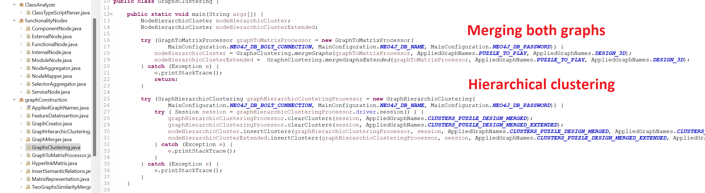
     	- one of clustered results should be following:  
  	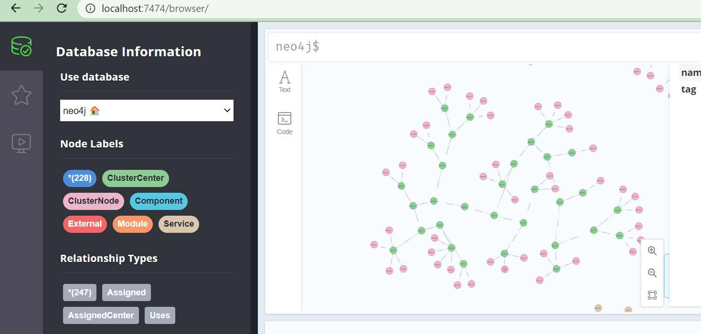
- 3. analyze merged values and relations:  
  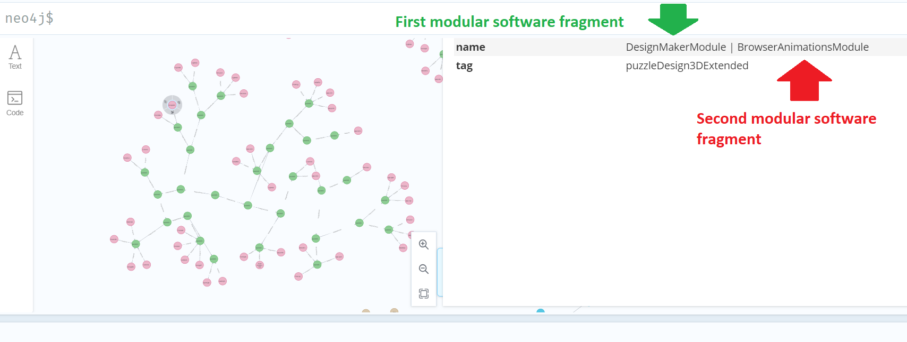 

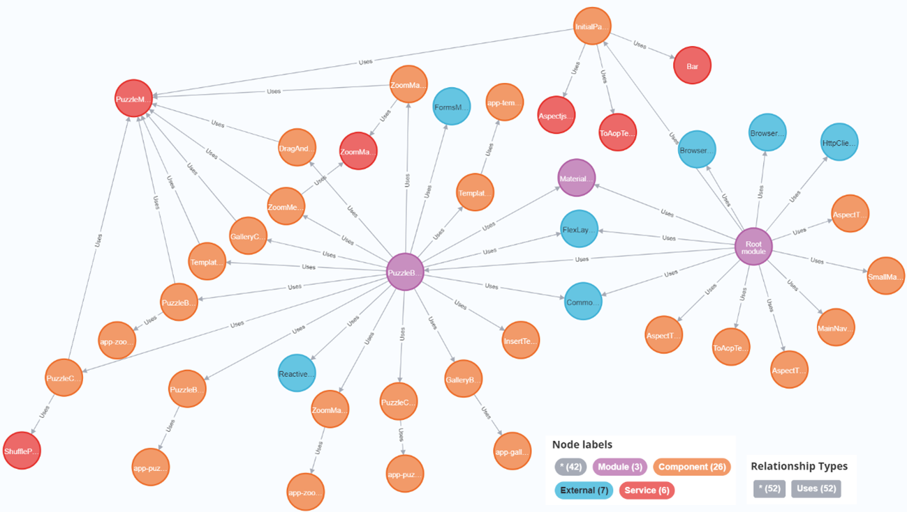

### Observe similarities between given components (only one of applications is required: Puzzle to Play is default)
- launching FeatureParser.java in parser package and output should look like this: 
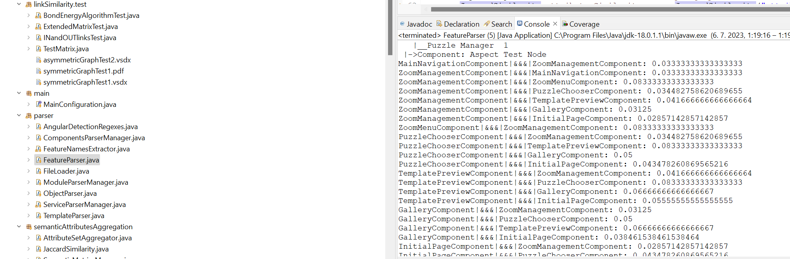

### Whole schema
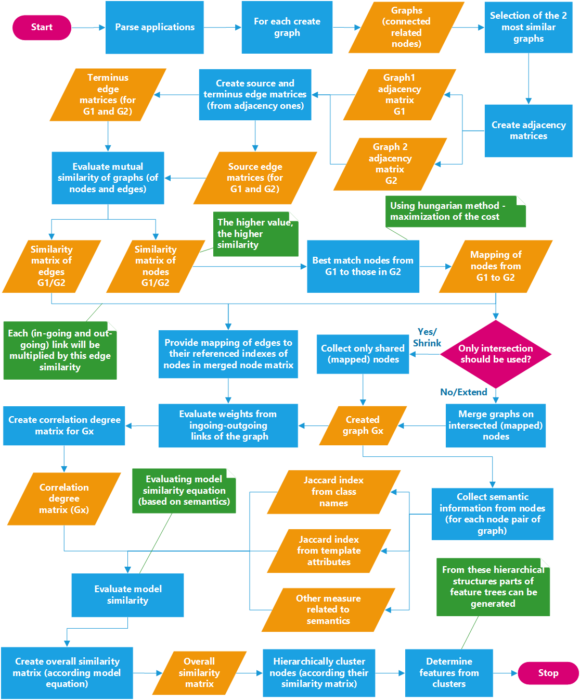

## Original methods

### Matrix Based Graph Clustering

Folder: graphConstruction, linkSimilarity  

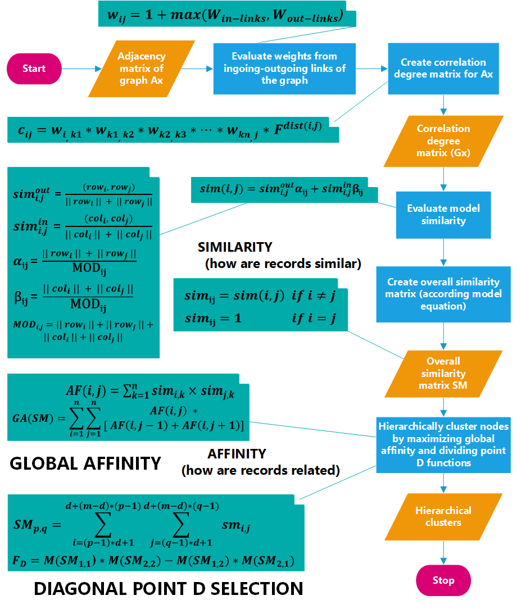

Majority of work is from:  

HOU, Jingyu, Yanchun ZHANG a Jinli CAO, 2003. Web Page Clustering: A
Hyperlink-Based Similarity and Matrix-Based Hierarchical Algorithms. V: Xiaofang
ZHOU, Maria E. ORLOWSKA a Yanchun ZHANG, ed. Web Technologies and
Applications [online]. Berlin, Heidelberg: Springer Berlin Heidelberg, Lecture Notes in
Computer Science, s. 201–212 [cit. 3.12.2022]. ISBN 978-3-540-02354-8. Dostupné na:
doi:10.1007/3-540-36901-5_22

@incollection{goos_web_2003,
	address = {Berlin, Heidelberg},
	title = {Web {Page} {Clustering}: {A} {Hyperlink}-{Based} {Similarity} and {Matrix}-{Based} {Hierarchical} {Algorithms}},
	volume = {2642},
	shorttitle = {Web {Page} {Clustering}},
	urldate = {2022-12-03},
   isbn = {978-3-540-02354-8 978-3-540-36901-1},
  url = {http://link.springer.com/10.1007/3-540-36901-5_22},
	booktitle = {Web {Technologies} and {Applications}},
	publisher = {Springer Berlin Heidelberg},
	author = {Hou, Jingyu and Zhang, Yanchun and Cao, Jinli},
	editor = {Goos, Gerhard and Hartmanis, Juris and van Leeuwen, Jan and Zhou, Xiaofang and Orlowska, Maria E. and Zhang, Yanchun},
	year = {2003},
	doi = {10.1007/3-540-36901-5_22},
	note = {Series Title: Lecture Notes in Computer Science},
	pages = {201--212},
	file = {Hou et al. - 2003 - Web Page Clustering A Hyperlink-Based Similarity .pdf:C\:\\Users\\perde\\Zotero\\storage\\42GY4HC5\\Hou et al. - 2003 - Web Page Clustering A Hyperlink-Based Similarity .pdf:application/pdf},
}

### Matrix Based Graph Comparison

Folder: graphSimilarities

#### Node-Similarity

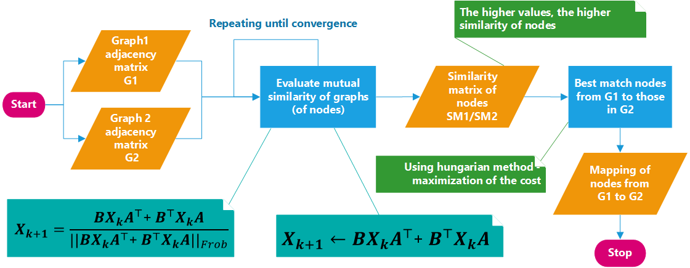

BLONDEL, Vincent D., Anahí GAJARDO, Maureen HEYMANS, Pierre
SENELLART a Paul VAN DOOREN, 2004. A Measure of Similarity between Graph
Vertices: Applications to Synonym Extraction and Web Searching. SIAM Review
[online]. 2004, roč. 46, č. 4, s. 647–666. ISSN 0036-1445, 1095-7200. Dostupné na:
doi:10.1137/S0036144502415960

@article{blondel_measure_2004,
	title = {A {Measure} of {Similarity} between {Graph} {Vertices}: {Applications} to {Synonym} {Extraction} and {Web} {Searching}},
	volume = {46},
	shorttitle = {A {Measure} of {Similarity} between {Graph} {Vertices}},
  issn = {0036-1445, 1095-7200},
	shorttitle = {A {Measure} of {Similarity} between {Graph} {Vertices}},
	url = {http://epubs.siam.org/doi/10.1137/S0036144502415960},
	doi = {10.1137/S0036144502415960},
	language = {en},
	number = {4},
	urldate = {2022-12-03},
	journal = {SIAM Review},
	author = {Blondel, Vincent D. and Gajardo, Anahí and Heymans, Maureen and Senellart, Pierre and Van Dooren, Paul},
	month = jan,
	year = {2004},
	pages = {647--666},
	file = {Blondel et al. - 2004 - A Measure of Similarity between Graph Vertices Ap.pdf:C\:\\Users\\perde\\Zotero\\storage\\3A8NS5HM\\Blondel et al. - 2004 - A Measure of Similarity between Graph Vertices Ap.pdf:application/pdf},
}

#### Node-Edge Similarity

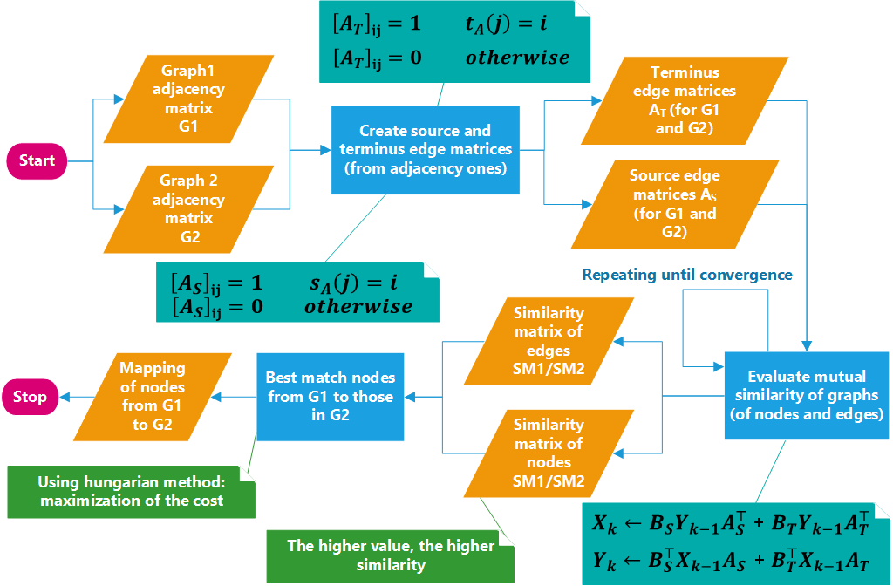  

ZAGER, Laura A. a George C. VERGHESE, 2008. Graph similarity scoring and
matching. Applied Mathematics Letters [online]. 2008, roč. 21, č. 1, s. 86–94. ISSN
08939659. Dostupné na: doi:10.1016/j.aml.2007.01.006

@article{zager_graph_2008,
	title = {Graph similarity scoring and matching},
	volume = {21},
	language = {en},
	number = {1},
	urldate = {2022-12-03},
	journal = {Applied Mathematics Letters},
	author = {Zager, Laura A. and Verghese, George C.},
   issn = {08939659},
	url = {https://linkinghub.elsevier.com/retrieve/pii/S0893965907001012},
	doi = {10.1016/j.aml.2007.01.006},
	month = jan,
	year = {2008},
	pages = {86--94},
	file = {Zager a Verghese - 2008 - Graph similarity scoring and matching.pdf:C\:\\Users\\perde\\Zotero\\storage\\Y247CJA8\\Zager a Verghese - 2008 - Graph similarity scoring and matching.pdf:application/pdf},
}

### Hungarian method

Taken from:  
https://github.com/KevinStern/software-and-algorithms/blob/master/src/main/java/blogspot/software_and_algorithms/stern_library/optimization/HungarianAlgorithm.java

All diagrams, majority of code and tests are mine.
